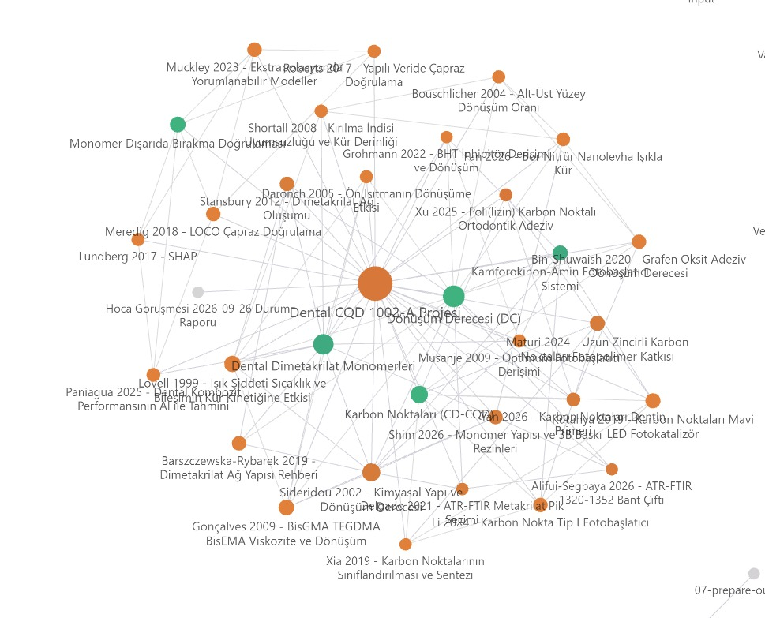

# obsidian-vault-skill

Obsidian vault'unu **proje bazlı kişisel wiki** olarak yöneten bir [Claude Code](https://claude.com/claude-code) skill'i.

Claude; kaynakları (PDF, link, metin) damıtılmış ve birbirine bağlı notlara çevirir, projelerini ayrı klasörlerde tutar, ortak kavramları tek sayfada toplar ve sorularını notlarına atıf vererek cevaplar.

Fikir, Andrej Karpathy'nin [LLM Wiki](https://gist.github.com/karpathy/442a6bf555914893e9891c11519de94f) desenine dayanır: bilgi tabanını sen değil LLM kurar ve bakımını yapar; ham kaynaklar birbirine bağlı markdown sayfalarına "derlenir". Bu skill o deseni proje bazlı bir yapıya, index'in şişmemesi için kategori sayfalarına ve bir bakım script'ine uyarlar.



## Neler yapar

| Söylediğin | Olan |
|---|---|
| "bunu vault'a kaydet" | Konuşmadaki bilgi uygun sayfaya damıtılarak yazılır |
| "Inbox'u işle", "bu PDF'i ekle" | Özet sayfası + kavram sayfaları oluşur, wikilink'lerle bağlanır |
| "notlarıma göre …" | `index.md` → kategori sayfası → ilgili sayfalar okunur, cevap `[[sayfa]]` atıflarıyla gelir |
| "bu projeyi vault'a ekle" | `Projeler/<Ad>/` klasörü, proje sayfası ve log açılır |
| "vault'u kontrol et" | `scripts/check.py` çalışır: kırık link, çakışan dosya adı, yetim sayfa, kategorisiz kavram, bekleyen Inbox raporu |

## Vault yapısı

```
<Vault>/
├── index.md              ← giriş: proje tablosu + kategori listesi (küçük kalır)
├── log.md                ← vault düzeyi işlemler
├── Vault Kullanımı.md
├── Inbox/                ← işlenecek ham kaynaklar
│   └── İşlendi/          ← işlenmiş kaynaklar
├── Kavramlar/            ← ortak kavramlar, tek kopya, projesiz
│   └── Kategoriler/      ← "<Kategori> Kavramları.md": kavram listeleri
└── Projeler/<Ad>/
    ├── <Ad> Projesi.md
    ├── <Ad> Log.md
    └── …
```

Temel kural: **Projeye ait her şey kendi klasöründe, kavramlar ortak ve projesiz.** Kavram sayfasında projeye özel kullanım `## <Ad> projesinde` bölümüne yazılır. Vault'taki diğer klasörler senin notlarındır; Claude onları okur ve link verir ama izinsiz değiştirmez.

## Kurulum

```bash
npx skills add burakyalcin10/obsidian-vault-skill --skill vault -g -a claude-code
```

ya da `skills/vault/` klasörünü elle `~/.claude/skills/vault/` altına kopyala.

Sonra vault yolunu global `~/.claude/CLAUDE.md` dosyana ekle:

```markdown
vault: C:\Users\<sen>\Documents\Obsidian Vault
```

Bir projede farklı bir vault kullanmak için aynı satırı o projenin `CLAUDE.md` dosyasına yaz; proje ayarı globali ezer. Satır hiç yoksa Claude ilk kullanımda yolu sorar.

Vault boşsa ya da kökte `index.md` yoksa Claude yapıyı ilk kullanımda kurar.

## Önerilen

Not sözdizimi, canvas ve Bases için [kepano/obsidian-skills](https://github.com/kepano/obsidian-skills) (`obsidian-markdown`, `json-canvas`, `obsidian-bases`). Zorunlu değil; skill bunlar olmadan da çalışır.

## Dil

Skill ve oluşturduğu notlar Türkçedir. Tetikleyiciler Türkçe ve İngilizce.

## Lisans

MIT
